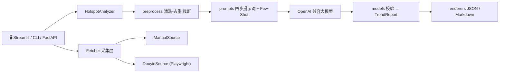

# 🔥 抖音热点深度分析工具（Hotspot Analysis）

<p align="center">
  
  
  
  
  
  
</p>

输入 **热点词条** 与 **高赞评论 / 相关文本**，调用任意 OpenAI 兼容大模型，按四步逻辑输出
**结构化 JSON** 与 **中文 Markdown 报告**，一键导出 **可直接开拍的短视频分镜脚本**。

> 面向：短视频运营、品牌借势营销、MCN 编导、传播学研究者。

---

## ✨ 核心特性

| 能力 | 说明 |
| --- | --- |
| 🧠 **四步分析** | 噪声过滤 → 情绪解构 → 传播引爆点 → 行动落地，输出可校验的结构化报告 |
| 🔌 **模型无关** | 仅改环境变量即可切换 DeepSeek / 通义千问 / Kimi / OpenAI，零代码改动 |
| 🛡️ **提示词护栏** | Few-Shot 锚定 + 字段强约束 + JSON 解析失败自动「修复重试」，抑制幻觉 |
| 💰 **成本可控** | 输入按信息密度截断、内置模型价目表、Token/耗时/成本全链路可观测 |
| 🕵️ **采集解耦** | `HotspotSource` 协议 + 注册表，内置手动源与 Playwright 抖音源，可插拔扩展 |
| 🎬 **爆款对标** | 按「最多点赞」抓取 Top1~Top3 头部爆款，附封面 / 作者 / 点赞高亮 |
| 📥 **一键导出** | Markdown 报告 / JSON 源码 / **短视频拍摄脚本（.md）** 三类产物直接落盘 |
| 🖥️ **三种入口** | Typer CLI、FastAPI、Streamlit 可视化工作台，共用同一套核心逻辑 |

---

## 🧭 四步分析逻辑

1. **噪声过滤** — 剔除严肃政务通报 / 低质明星八卦 / 纯水军营销 / 突发事故，给出内容价值分（0-100）
2. **情绪解构** — 提炼大众痛点、核心情绪、集体无意识（对立站队、玩梗狂欢等）
3. **传播引爆点** — 推导上热搜机制（视觉冲突 / 争议站队 / 稀缺爆料）与二次创作潜力
4. **行动落地** — 输出 2-3 个可直接开拍的切入角度（含 3 秒 Hook、分镜提纲、执行步骤、变现路径、合规风险）

---

## 🏗️ 架构总览



- **关注点分离**：分析器只认 `keyword + raw_text`；「数据从哪来」由采集层负责。
- **界面解耦**：[`app.py`](app.py:1) 仅依赖 `HotspotAnalyzer` / `renderers` / `fetcher` 公共接口，可随时替换前端。

---

## 🚀 快速开始

### 1️⃣ 安装

环境要求：**Python 3.10+**

```bash
pip install -r requirements.txt
```

### 2️⃣ 配置

复制 `.env.example` 为 `.env`，填入所用厂商的接口地址与 Key：

```bash
copy .env.example .env
```

```dotenv
OPENAI_BASE_URL=https://api.deepseek.com/v1
OPENAI_API_KEY=sk-your-key-here
OPENAI_MODEL=deepseek-chat
OPENAI_TEMPERATURE=0.3
```

已内置常见厂商地址（见 [`KNOWN_PROVIDERS`](hotspot_analysis/config.py:110)）：

| 厂商 | OPENAI_BASE_URL | 示例模型 |
| --- | --- | --- |
| DeepSeek | `https://api.deepseek.com/v1` | `deepseek-chat` |
| 通义千问 | `https://dashscope.aliyuncs.com/compatible-mode/v1` | `qwen-plus` |
| Kimi | `https://api.moonshot.cn/v1` | `moonshot-v1-8k` |
| OpenAI | `https://api.openai.com/v1` | `gpt-4o-mini` |

> 若模型不支持 `response_format=json_object`，在 `.env` 设 `OPENAI_USE_JSON_MODE=false`。
> 程序也会在报错时自动降级重试一次。

### 3️⃣ 选一种方式运行

```bash
# A. 命令行
python -m hotspot_analysis.cli --keyword "年轻人开始流行反向消费" --text "高赞评论：…"

# B. 可视化工作台
pip install -r requirements-ui.txt && streamlit run app.py

# C. Web API
uvicorn hotspot_analysis.api:app --reload --port 8000
```

---

## ⚙️ 进阶配置（v0.2）

| 配置项 | 默认值 | 说明 |
| --- | --- | --- |
| `MAX_RAW_TEXT_CHARS` | `3000` | 输入文本最大字符数，超出自动按信息密度截断 |
| `LOG_LEVEL` | `INFO` | 结构化日志级别 `DEBUG/INFO/WARNING/ERROR` |
| `LOG_DIR` | `logs` | 日志目录，产出 JSON 行日志并自动轮转（5MB × 3） |
| `OPENAI_PRICE_INPUT_PER_1M` | 自动匹配 | 输入 token 单价（美元/百万），留空则查内置价目表 |
| `OPENAI_PRICE_OUTPUT_PER_1M` | 自动匹配 | 输出 token 单价（美元/百万） |
| `MOCK_MODE` | `false` | 开启后跳过真实请求，读取离线样例，秒级零成本调优 |
| `MOCK_FILE` | `examples/sample_output.json` | 自定义 Mock 数据源 |

内置模型价目表见 [`KNOWN_PRICES`](hotspot_analysis/config.py:132)（覆盖 deepseek / qwen / moonshot / gpt 系列），
按模型名前缀模糊匹配，也可用环境变量精确覆盖。

---

## 🖥️ 命令行用法

### 离线体验（无需 API Key）

```bash
python -m hotspot_analysis.cli --demo --format both --out ./output
```

使用内置样例数据生成完整报告，便于先查看输出格式。

### 离线 Mock 模式（推荐开发 / 测试）

```bash
# 方式一：CLI 参数（临时生效）
python -m hotspot_analysis.cli --keyword "Mock联调验证" --text "..." --mock

# 方式二：环境变量（全局生效）
set MOCK_MODE=true && python -m hotspot_analysis.cli -k "Mock联调验证"
```

不发起任何网络请求、不消耗 token，直接读取 [`examples/sample_output.json`](examples/sample_output.json:1)，
并在报告顶部标注 Mock 警告横幅。适合 UI 联调、CI 单测与提示词迭代。

### 单条 / 批量分析

```bash
# 单条
python -m hotspot_analysis.cli --keyword "年轻人开始流行反向消费" --text "高赞评论：不是不想买，是真买不起…"

# 批量（JSON 文件，支持单条对象或数组）
python -m hotspot_analysis.cli --file examples/sample_input.json --format both --out ./output
```

### 参数说明

| 参数 | 说明 |
| --- | --- |
| `--keyword, -k` | 热点词条 |
| `--text, -t` | 相关文本 / 高赞评论 |
| `--file, -f` | 批量输入 JSON（单条或数组） |
| `--format` | `md`（默认） / `json` / `both` |
| `--out, -o` | 输出文件或目录；`both` 或传入目录时按词条名分别落盘 |
| `--demo` | 使用内置样例数据离线生成报告（无需 API Key） |
| `--mock` | 离线 Mock 模式：跳过真实请求，读取样例数据（等同于 `MOCK_MODE=true`） |
| `--source` | 采集数据源：`douyin`（Playwright 浏览器自动化）/ `manual` |
| `--hot-limit` | 采集热榜条数上限（默认 10） |
| `--comments-per` | 每条热点抓取评论数上限（默认 50） |
| `--fetch-only` | 仅采集不分析（配合 `--fetch-dump` 导出） |
| `--fetch-dump` | 把采集结果保存为输入 JSON 文件 |
| `--storage-state` | Playwright 登录态文件（`storage_state.json`） |
| `--no-headless` | 采集时显示浏览器窗口，便于手动处理验证码 |
| `--show-config` | 打印脱敏配置后退出 |

---

## 🕸️ 自动采集抖音热榜（可选）

分析器本身**只接收 `keyword + raw_text`**，不直接访问抖音。若希望自动获取热榜，
启用可插拔的采集层（Fetcher）：

```bash
# 1) 安装可选依赖
pip install -r requirements-fetch.txt
python -m playwright install chromium

# 2) 采集热榜 + 评论，并直接跑完四步分析
python -m hotspot_analysis.cli --source douyin --hot-limit 10 --comments-per 50 ^
  --format both --out ./output

# 3) 只采集、导出为可复用输入（不消耗 token）
python -m hotspot_analysis.cli --source douyin --fetch-only --hot-limit 10 ^
  --fetch-dump ./output/douyin_hot.json

# 4) 再用导出文件做分析（可脱离采集环境反复调试）
python -m hotspot_analysis.cli --file ./output/douyin_hot.json --format md
```

未安装 Playwright 时会给出明确的安装提示并以退出码 3 退出，不影响其他功能。

### 采集层架构

```
HotspotSource(协议)  ──  list_hotspots() / fetch_comments() / list_top_videos()
      ├── ManualSource   手动 / 文件输入（内置，无额外依赖）
      └── DouyinSource   Playwright 浏览器自动化（可选依赖）
registry.get_source("douyin", **kwargs)  # 名称 → 工厂，可注册自定义源
collect_bundles(...)                     # 通用编排：榜单 → 评论 → Bundle
```

- **可注入解析脚本**：抖音 DOM 会改版，`DouyinSource` 支持传入自定义
  `hot_js` / `top_video_js` / `comment_js`，或继承重写 `_extract_hotspots()` / `_extract_comments()`。
- **标题清洗**：内置 [`_clean_title()`](hotspot_analysis/fetcher/douyin.py:468)
  去除时长前缀、`热点：`、热度与时间戳噪声。
- **合规提示**：请遵守抖音用户协议与 robots 规则，仅抓取公开数据并控制频率；
  登录态通过 `--storage-state` 注入，切勿硬编码账号密码。

---

## 🎨 图形界面（Streamlit，可选）

开箱即用的可视化工作台（[`app.py`](app.py:1)），把「预设填充」「手动输入」与「实时抓榜」合并到同一界面：

```bash
pip install -r requirements-ui.txt
streamlit run app.py
```

界面采用「看板 + 爆款对标 + 三 Tab」的层级布局：

| 层级 | 能力 |
| --- | --- |
| 🟢 全局环境状态 | 顶部状态标签：Playwright 采掘可用性 + API Key 配置状态 |
| 💡 Demo 秒级体验 | 空状态下展示 3 个预设爆款卡片，**一键填入并直接渲染分析面板** |
| ✍️ 手动分析 | `keyword` 输入框 + `raw_text` 多行文本框（卡片包裹），一键运行四步分析 |
| 🔥 实时热榜 | 科技感卡片内配置「热榜条数 / 评论数」滑块 + 抓取按钮，抓取后下拉选词条并分析 |
| 📊 运营看板 | 4 张彩色卡片：内容价值分 / 核心情绪 / 争议指数 / 跟风推荐度（带进度条） |
| 🔥 最高热度/点赞爆款对标 | 搜索页按「最多点赞」排序解析 Top1~Top3，卡片展示封面 / 作者 / 点赞高亮（Top1 标注「🔥 点赞量最高」）；**始终**渲染「🔥 查看该热点『最多点赞/播放』视频列表」直达按钮 |
| 🧾 三 Tab 报告 | 「💡 核心洞察」/「🎬 拍摄分镜剧本」/「⚙️ JSON 源码」 |
| 📥 一键导出 | Markdown 报告 / JSON 源码 / **短视频拍摄脚本** 三个下载按钮 |
| 🛠️ 指标明细 | 端到端耗时 / API 延迟 / Token / 成本下沉到折叠面板，不干扰主视觉 |
| ⚙️ 侧边栏 | 顶部仅保留 Mock 开关（toggle）、模型切换、API Key 状态；**开发者参数（含可编辑 API Key）全部收纳进「⚙️ 高级调试配置」折叠面板** |

### 🎨 视觉与交互设计

`app.py` 顶部通过 [`inject_global_css()`](app.py) 注入自定义 CSS，摆脱「黑白命令行调试工具」的观感：

- **卡片包裹感**：新增卡片统一使用 `st.container(border=True)`，配合针对
  `div[data-testid="stVerticalBlockBorderWrapper"]` 的圆角 / 细边框 / 悬浮阴影；
- **按钮动效**：所有 `st.button` / `st.download_button` / `st.link_button` 均带
  hover **渐变背景 + 微阴影 + 轻微上浮**，主按钮走蓝紫渐变；
- **标题层级**：`h1` 采用渐变文字与更紧凑的字距，`h2/h3` 统一间距，强化信息层级；
- **暗色主题**：通过 `@media (prefers-color-scheme: dark)` 与 `[data-theme="dark"]`
  双保险，为卡片、指标块、折叠面板提供精致的深色边界，避免暗色下发虚。

### 🎬 拍摄分镜剧本与脚本导出

「🎬 拍摄分镜剧本」Tab 将模型输出组织为**可直接开工**的形态：

- **黄金 3 秒 Hook** 用 `st.info()` 高亮提示框包裹，一眼可见；
- **内容分镜提纲**与**执行步骤**强制渲染为 Markdown 表格
  （`| 序号 | 画面/步骤 | 核心台词/Hook |`），大幅提升专业感；
- **变现 / 引流**与**合规风险**并排展示；
- **Tab 底部一键导出**：点击 `⬇️ 下载短视频拍摄脚本（Markdown）` 即可下载
  `{keyword}_短视频拍摄脚本.md`。

导出文档由 [`_build_storyboard_markdown()`](app.py) 生成，结构为：

```markdown
# 🎬 短视频拍摄脚本：{keyword}

> 生成时间：… ｜ 模型：`…`

## 🎯 决策建议
{一句话跟不跟的结论}

## 角度 1：{切入角度}
**🎯 目标人群**：…
**🪝 黄金 3 秒 Hook**
> {3 秒钩子话术}

**🎞️ 内容分镜提纲**
| 序号 | 画面 / 步骤 | 核心台词 / Hook |

**✅ 执行步骤**
| 步骤 | 操作说明 |

| 维度 | 说明 |
| 💰 变现 / 引流 | … |
| ⚠️ 合规风险 | … |
```

> 决策建议、Hook 与分镜表格会被格式化为标准 Markdown，可直接交给编导 / 摄影团队落地。

---

## 🌐 Web API（可选）

```bash
uvicorn hotspot_analysis.api:app --reload --port 8000
```

```bash
curl -X POST http://127.0.0.1:8000/analyze ^
  -H "Content-Type: application/json" ^
  -d "{\"keyword\":\"年轻人开始流行反向消费\",\"raw_text\":\"高赞评论…\"}"
```

响应包含 `report`（结构化 JSON）与 `markdown`（报告全文）。

---

## 🐍 作为库调用

```python
from hotspot_analysis.analyzer import HotspotAnalyzer
from hotspot_analysis.renderers import render_markdown

analyzer = HotspotAnalyzer()
report = analyzer.analyze("年轻人开始流行反向消费", "高赞评论：…")

print(report.noise_filtering.is_valuable_trend)   # 是否优质话题
print(report.noise_filtering.value_score)          # 内容价值 0-100
print(render_markdown(report))                      # Markdown 报告
```

> 若不想改动 `.env`，也可在命令行加 `--mock`。

---

## 📦 输出结构

```jsonc
{
  "meta": {
    "keyword": "年轻人开始流行反向消费",
    "model": "deepseek-chat",
    "elapsed_seconds": 12.4,
    "latency_ms": 12380,
    "prompt_tokens": 2100,
    "completion_tokens": 680,
    "total_tokens": 2780,
    "total_cost_usd": 0.000414,
    "repair_attempts": 0,
    "mock": false,
    "raw_text_chars": 2860,
    "raw_text_truncated": false,
    "deduped_lines": 4
  },
  "noise_filtering": { "is_valuable_trend": true, "noise_type": "有效话题", "value_score": 82 },
  "emotion_decoding": { "pain_points": [], "core_emotions": [], "emotion_intensity": 78 },
  "viral_mechanism": { "triggers": [], "controversy_level": 65 },
  "actionable_insights": [ { "angle_title": "...", "hook": "...", "content_outline": [] } ],
  "conclusion": "..."
}
```

Markdown 报告的「运行信息」区块会同步展示：模式（真实 / Mock）、端到端耗时、预估成本、
输入预处理统计（原始字符数 / 去重行数 / 是否截断）。

模型定义见 [`models.py`](hotspot_analysis/models.py:1)，样例报告见
[`examples/sample_output.md`](examples/sample_output.md:1)。

---

## 🧩 增强能力说明（v0.2）

### 1. 结构化日志与 Token 成本监控

- 每次请求记录 `prompt_tokens / completion_tokens / total_tokens / latency_ms / total_cost_usd`，
  以及 JSON 修复重试（`analyze_retry`）事件。
- 日志同时输出到控制台与 `logs/hotspot_analysis.log`，采用 **JSON Lines** 格式，便于采集与看板统计。
- 成本按模型单价估算；未配置时自动查内置价目表 [`KNOWN_PRICES`](hotspot_analysis/config.py:132)。

实现见 [`logging_config.py`](hotspot_analysis/logging_config.py:1) 与
[`config.py`](hotspot_analysis/config.py:82) 的 `estimate_cost()`。

### 2. 提示词护栏 / 防幻觉

- **Few-Shot 示例**：注入「1 条有效话题 + 1 条噪声话题」标准 JSON，锚定输出结构与判定尺度。
- **字段强约束**：行动建议必须给出可直接开拍的 3 秒钩子；禁止返回空数组或「无 / 不清楚」等模糊概括；
  `content_outline` 至少 3 条、`execution_steps` 至少 2 条。
- 解析失败自动进入「修复重试」，将报错信息回灌模型重新生成。

实现见 [`prompts.py`](hotspot_analysis/prompts.py:1) 的
`SYSTEM_PROMPT` 与 [`build_fewshot_messages()`](hotspot_analysis/prompts.py:232)。

### 3. 输入清洗与截断

- 剔除零宽字符、控制字符，合并重复符号（如 `!!!!!!`）。
- 对高赞评论按行去重，过滤刷屏 / 水军重复内容。
- 按信息密度排序（长文本优先），并在 `MAX_RAW_TEXT_CHARS`（默认 3000）处按换行边界截断。

实现见 [`preprocess.py`](hotspot_analysis/preprocess.py:1) 的 `preprocess_raw_text()`。

### 4. 离线 Mock / Dry-Run 模式

- `MOCK_MODE=true`（或 CLI `--mock`）时，分析器跳过 API 调用，直接读取
  [`examples/sample_output.json`](examples/sample_output.json:1)，实现零成本开发。
- 报告 meta 中 `mock=true`，Markdown 顶部输出 Mock 警告横幅，避免与真实结果混淆。

### 5. 采集层（Fetcher）

- **关注点分离**：分析器只用 `keyword + raw_text`；采集独立成
  [`hotspot_analysis/fetcher/`](hotspot_analysis/fetcher/base.py:1) 包，可插拔替换。
- **协议驱动**：`HotspotSource` 协议 + `registry` 注册表，新增数据源无需改动分析逻辑。
- **Markdown 稳健性**：渲染器用 `_one_line()` 折叠字段内换行，避免破坏引用块 / 列表结构。

### 6. Streamlit 图形界面与可视化（Phase 3）

- **复用后端**：界面层仅做编排，分析调用与 CLI 完全一致，避免逻辑分叉。
- **多路径入口**：Demo 卡片 / 手动输入 / 实时抓榜共用同一套结果渲染。
- **产品化视觉**：全局 CSS 注入（卡片边界、按钮 hover 渐变、标题层级、暗色主题适配），
  实时热榜配置区收进科技感卡片，正文不再暴露 `pip install` 等开发者提示。
- **空状态填充**：无结果时 [`render_demo_shortcuts()`](app.py) 渲染 3 个 Demo 按钮，
  经 `on_click` 回调 **一键回填词条并直接渲染分析面板**，提升产品展示效果。
- **侧边栏收纳**：`API Key（可编辑） / Base URL / 采样温度 / 最大字符数 / 修复重试` 统一收入
  「⚙️ 高级调试配置」折叠面板，顶部仅留核心开关。API Key **默认回退虚拟环境 / `.env` 的
  `OPENAI_API_KEY`**；若环境变量为空，则面板内提示用户就地填写（仅本会话临时覆盖，不写盘）。
- **头部爆款对标**：采集层 [`list_top_videos()`](hotspot_analysis/fetcher/douyin.py:373)
  打开抖音搜索页 `?type=video&sort_type=most_like`，解析并**按点赞量降序**取 Top1~Top3，
  用于「🔥 最高热度/点赞爆款对标」展示对标样本。
- **源视频可视化**：[`VideoItem`](hotspot_analysis/fetcher/base.py:41)
  承载视频链接、封面、作者与点赞数；Playwright 脚本解析 `href` / `src` / `data-src`
  并补全相对路径，前端据此渲染卡片墙，Top1 额外标注「🔥 点赞量最高」。
- **防空兜底**：排序页改版 / 风控或未解析出视频时，
  [`douyin_search_url(keyword, sort_by_like=True)`](hotspot_analysis/fetcher/base.py:23)
  生成「最多点赞」搜索页链接，保证界面**永远**有明确的最高热度视频入口，
  不再出现「未解析到具体视频」这类弱化提示。
- **运营看板化**：4 张彩色指标卡承担决策信息，调试类指标下沉折叠面板。
- **结构化脚本与导出**：分镜与执行步骤以表格呈现、Hook 高亮，并在 Tab 底部提供
  [`_build_storyboard_markdown()`](app.py) / `_storyboard_download()` 一键导出
  `{keyword}_短视频拍摄脚本.md`，可直接交付拍摄。
- **冒烟测试**：[`tests/test_app_import.py`](tests/test_app_import.py:1) 校验模块可导入、
  `main` 可调用、预设完整、分镜表格与脚本导出正确；未安装 Streamlit 时自动跳过。

---

## ✅ 测试

```bash
pytest -q
```

测试完全离线（mock 数据 + 渲染 + JSON 提取 + 提示词组装 + 采集层解析），无需 API Key 与浏览器。

当前状态：**81 passed / 2 skipped**（跳过项为需要浏览器 / 可选依赖的用例）。

---

## 📁 目录结构

```
hotspot_analysis/
├── config.py       # 环境变量与模型配置（模型无关）+ 成本估算
├── models.py       # TrendReport 及四段式子模型
├── prompts.py      # 四步逻辑系统提示词 + Few-Shot + JSON Schema
├── preprocess.py   # 输入清洗 / 去重 / 按信息密度截断
├── logging_config.py  # 结构化 JSON 日志（控制台 + 文件轮转）
├── analyzer.py     # OpenAI 兼容调用 + JSON 修复重试 + Mock 模式
├── renderers.py    # JSON / Markdown 渲染
├── demo_data.py    # 内置离线样例报告（--demo）
├── cli.py          # 命令行入口
├── api.py          # FastAPI 接口
└── fetcher/        # 采集层（可插拔数据源）
    ├── base.py     #   Hotspot / HotspotBundle / HotspotSource 协议 + 编排
    ├── manual.py   #   手动 / 文件数据源
    ├── douyin.py   #   抖音热榜 + 按赞排序爆款（Playwright 自动化）
    └── registry.py #   名称 → 工厂注册表
app.py              # Streamlit 图形界面（预设/手动/热榜 + 看板 + 脚本导出）
examples/           # 样例输入与输出（含 sample_output.json 作为 Mock 源）
tests/              # 离线测试
plans/              # 架构实施方案
logs/               # 结构化日志（已 gitignore）
output/             # 运行产物（已 gitignore）
requirements-fetch.txt  # 采集层可选依赖（Playwright）
requirements-ui.txt     # 图形界面可选依赖（Streamlit）
```

---

## 🎯 设计说明

- **模型无关**：仅通过环境变量切换厂商，零代码改动。
- **强 JSON 约束**：优先 `json_object`，失败自动降级并做一次「修复重试」。
- **解析容错**：自动剥离 ```json 代码块、截取首尾大括号。
- **噪声短路**：判定为噪声后，情绪 / 传播步骤返回 `skipped`，仍输出判断依据。
- **合规兜底**：每条行动建议强制包含 `risk_notes`。
- **可观测**：结构化日志记录 token 用量、成本与延迟，支撑成本监控。
- **可控成本**：输入自动截断 + 离线 Mock 模式，让调优阶段零 API 开销。
- **采集解耦**：`HotspotSource` 协议让「数据从哪来」与「怎么分析」互不影响，
  可平滑接入官方开放平台 / 第三方数据服务。
- **界面解耦**：`app.py`（Streamlit）仅依赖公共接口，可随时替换为其他前端而不改动核心逻辑。
- **产出可交付**：从「分析结论」到「可开拍脚本」全程打通，导出即用。

---

## 🗺️ Roadmap

- [ ] 更多采集源：抖音开放平台 / 第三方数据服务适配器
- [ ] 报告多语言（英文版提示词与渲染器）
- [ ] 一键生成字幕脚本与配音文案
- [ ] 批量热点趋势对比看板（时间序列）
- [ ] Docker 一键部署镜像

---

## ⚠️ 免责声明

本项目仅用于**公开数据的传播分析与内容创作辅助**。使用时请遵守目标平台用户协议与
robots 规则，控制抓取频率，不得用于爬取隐私数据或任何违法用途。分析结论由大模型生成，
仅供参考，请自行核验事实并承担合规责任。

## 📄 License

MIT
