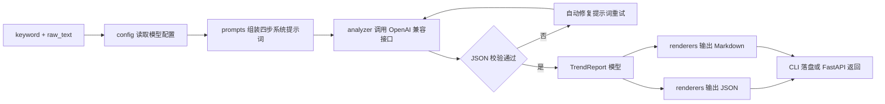

# 抖音热点深度分析工具 — 实施方案

## 一、项目目标

输入「热点词条 keyword」与「相关内容/高赞评论 raw_text」，调用 OpenAI 兼容大模型，按四步分析逻辑
（噪声过滤 → 情绪解构 → 传播引爆点 → 行动落地）输出**结构化 JSON** 与**中文 Markdown 报告**。

面向角色：短视频运营总监、传播学者、数据分析师。

## 二、技术栈

| 层 | 选型 |
| --- | --- |
| 语言 | Python 3.10+ |
| LLM 调用 | `openai` SDK（自定义 `base_url`，兼容 DeepSeek / 通义 / Kimi 等） |
| 数据校验 | `pydantic` v2 |
| CLI | `typer` + `rich` |
| API（可选） | `fastapi` + `uvicorn` |
| 配置 | `python-dotenv` |
| 测试 | `pytest` |

## 三、核心分析逻辑（四步）

### Step 1 噪声过滤 (Noise Filtering)
判定热点是否为优质可二次创作话题。噪声类型枚举：
- `政务通报` 严肃、无 UGC 空间
- `明星八卦` 低质、无内容复用价值
- `水军营销` 纯商业刷量、无真实讨论
- `突发事故` 不宜蹭热度（合规风险）
- `有效话题` 具备真实讨论与二次创作价值

输出 `is_valuable_trend` 布尔值、`noise_type`、`noise_reason`、`value_score`（0-100）。
若 `is_valuable_trend = false`，仍需输出判断依据，后续三步可标记为 `skipped`。

### Step 2 情绪解构 (Emotion Decoding)
提炼大众痛点、核心情绪、集体无意识与情绪标签：
- `pain_points` 痛点（如消费降级焦虑、职场内卷、婚恋压力）
- `core_emotions` 核心情绪（愤怒 / 共鸣 / 猎奇 / 羡慕 / 解气 / 焦虑）
- `collective_unconscious` 集体无意识（对立站队、玩梗狂欢、身份认同）
- `emotion_intensity` 情绪强度 0-100

### Step 3 传播引爆点 (Viral Mechanism)
推导上热搜的机制：
- `triggers` 引爆因子（强视觉冲突 / 争议观点致评论区大战 / 稀缺爆料 / 情绪共振 / 群体模仿）
- `visual_conflict` 视觉冲突描述
- `controversy_level` 争议指数 0-100
- `rarity` 信息稀缺度
- `secondary_creation_potential` 二次创作潜力（模板化程度）

### Step 4 行动落地 (Actionable Insights)
给出 2-3 个可直接开拍的切入角度，每项包含：
- `angle_title` 角度标题
- `target_audience` 目标人群
- `hook` 前 3 秒钩子话术
- `content_outline` 内容分镜提纲（列表）
- `execution_steps` 执行步骤
- `monetization` 变现/带货或引流路径
- `risk_notes` 合规与风险提示

## 四、目录结构

```
Hotspot Analysis/
├── README.md
├── requirements.txt
├── .env.example
├── hotspot_analysis/
│   ├── __init__.py
│   ├── config.py          # 环境变量与模型配置
│   ├── models.py          # TrendReport 及子模型
│   ├── prompts.py         # 四步分析系统提示词与评分规约
│   ├── analyzer.py        # LLM 调用 + JSON 修复重试
│   ├── renderers.py       # JSON / Markdown 渲染
│   ├── cli.py             # CLI 入口
│   └── api.py             # FastAPI 接口
├── examples/
│   ├── sample_input.json
│   └── sample_output.md
├── tests/
│   └── test_renderers.py
└── plans/
    └── hotspot-analysis-plan.md
```

## 五、数据流



## 六、关键设计点

1. **强 JSON 约束**：优先使用 `response_format={"type": "json_object"}`；对无该能力的模型退化为
   「提示词内嵌 schema + 代码块剥离 + `json.loads` + 失败走一次修复重试」。
2. **模型无关**：全部配置走环境变量（`OPENAI_BASE_URL`、`OPENAI_API_KEY`、`OPENAI_MODEL`），
   切换厂商零改代码。
3. **双格式输出**：`--format json|md|both`，`--out` 指定落盘路径，缺省打印到 stdout。
4. **可批量**：CLI 支持 `--file input.json`（数组形式）批量分析，逐条输出。
5. **合规兜底**：`risk_notes` 强制字段，用于提示蹭热点时的平台规则与舆论风险。
6. **成本可控**：单次调用 + 最多 1 次修复重试；记录 token 用量到 `meta`。

## 七、验收标准

- 提供真实 keyword 与评论即可跑出完整四段式报告。
- 噪声热点能正确返回 `is_valuable_trend=false` 并说明原因。
- JSON 输出可被 `pydantic` 模型校验通过，Markdown 报告结构清晰可读。
- 更换 `OPENAI_BASE_URL/MODEL` 后可无缝切换到 DeepSeek / 通义 / Kimi。
